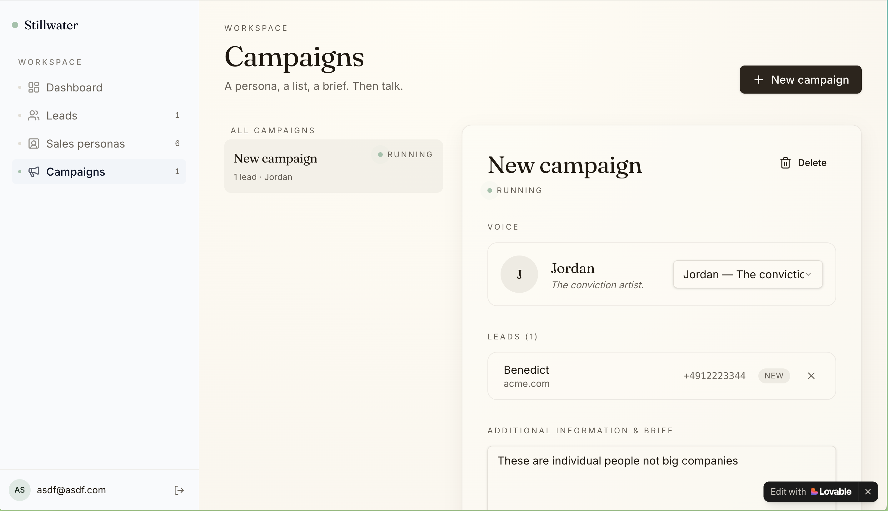
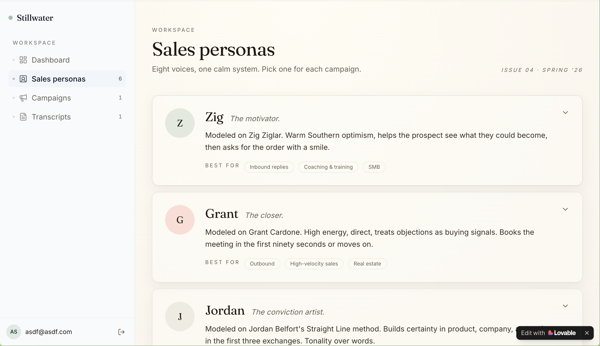

# Stillwater

> Cold calls that close themselves.

Stillwater is an AI-powered outbound sales platform that runs voice conversations with your leads on your behalf. You define a campaign (who you are, what you sell, who your customers are, what you want to talk about), pick a sales persona with its own voice, point it at a list of leads — and Stillwater handles the call, transcribes the conversation, and generates a structured report at the end.

Built at the **Big Berlin Hack** (Berlin AI Hackathon, hosted by The Delta Campus & Code University of Applied Sciences).

---

## How it works

<!-- TODO: add hero / product screenshot here -->


1. **Create a campaign.** Each campaign represents one company / one offer. You fill in your company identity (name, tagline, what you do, value prop, target customer, logo) and the talking points you want the agent to hit.
   <!-- TODO: screenshot of the campaign editor -->
    

2. **Pick a sales persona.** Personas are reusable AI sellers, each with their own personality, prompt, and **voice**. Stillwater seeds a few defaults (e.g. consultative, energetic, technical) and you can edit any of them — including swapping the voice — from the Personas page.
   <!-- TODO: screenshot of the personas page -->
   

3. **Add leads.** Import or create leads (name, company, phone, notes) and attach them to a campaign.
   <!-- TODO: screenshot of the leads page -->
   

4. **Run the call.** Stillwater opens a live conversation: the agent speaks first using the persona's voice, listens to the prospect through the browser mic, transcribes via the Gradium speech API, and replies in real time using a system prompt hydrated from the campaign's company context. In the future Stillwater will directly use the Twilio API to make cold calls to each individual lead.
   <!-- TODO: screenshot of an active conversation -->
   

5. **Review the report.** When the call ends, Stillwater stores the full transcript and generates a structured report (summary, objections, next steps) you can review from the dashboard.
   <!-- TODO: screenshot of a finished run / report -->
   

---

## Tech stack

### Hackathon partner technologies (Big Berlin Hack)

Stillwater is built on three official Big Berlin Hack partner technologies:

- **[Lovable](https://lovable.dev)** — the entire app (frontend + backend scaffolding, auth, database, storage, server functions) is generated and iterated on inside Lovable. Lovable Cloud provides the managed Postgres + Auth + Storage + Edge Functions layer behind the scenes.
- **[Gradium](https://gradium.ai)** — powers the realtime voice layer end-to-end: low-latency speech-to-text on the prospect's mic input, the conversational LLM that drives the sales agent, and natural text-to-speech for the agent's voice (each persona maps to a specific Gradium voice ID).
- **[Google DeepMind — Gemini](https://ai.google.dev)** — used to generate the **structured sales report** at the end of every call. We call `gemini-2.5-flash` via the Generative Language API with a strict `responseSchema` and fully deterministic decoding (`temperature: 0`, `topP: 0`, `topK: 1`, fixed `seed`) so the same transcript always produces the same report.

### Other libraries & tooling

- **Framework:** [TanStack Start](https://tanstack.com/start) v1 (React 19 + SSR) on Vite 7
- **Deploy target:** Cloudflare Workers (via `@cloudflare/vite-plugin` + `wrangler`)
- **Routing:** TanStack Router (file-based, in `src/routes/`)
- **Data fetching:** TanStack Query
- **Styling:** Tailwind CSS v4 (configured via `src/styles.css`) + `tw-animate-css`
- **UI primitives:** shadcn/ui on top of Radix UI, `lucide-react` icons, `sonner` for toasts
- **Forms & validation:** `react-hook-form` + `zod` (`@hookform/resolvers`)
- **Database client:** `@supabase/supabase-js` (against the Lovable Cloud-managed Postgres)
- **Language / tooling:** TypeScript (strict), ESLint, Prettier, Bun as the package manager

### Project structure

```
.
├── src/
│   ├── routes/                     # File-based routes (TanStack Router)
│   │   ├── __root.tsx              # Root shell: <html>, providers, fonts
│   │   ├── index.tsx               # Landing page
│   │   ├── login.tsx               # Auth (email + Google)
│   │   ├── dashboard.tsx           # Overview of recent runs
│   │   ├── leads.tsx               # Lead CRUD
│   │   ├── personas.tsx            # Sales personas (incl. voice picker)
│   │   ├── campaigns.tsx           # Campaign editor (company info lives here)
│   │   ├── flows.$flowId.tsx       # Single flow editor
│   │   ├── runs.$runId.tsx         # Run detail / report
│   │   └── conversations.$runId.tsx# Live voice conversation UI
│   ├── components/
│   │   ├── AppShell.tsx            # Authenticated layout with sidebar
│   │   ├── AppSidebar.tsx          # Workspace navigation
│   │   └── ui/                     # shadcn/ui primitives
│   ├── lib/
│   │   ├── auth-context.tsx        # Auth provider + hooks
│   │   ├── gradium.functions.ts    # Server functions: TTS, STT, agent reply
│   │   └── utils.ts
│   ├── hooks/                      # Reusable React hooks
│   ├── integrations/supabase/      # Auto-generated client + types (do not edit)
│   ├── router.tsx                  # Router bootstrap + QueryClient
│   └── styles.css                  # Tailwind v4 entry + design tokens
├── supabase/
│   ├── config.toml                 # Project + edge function config
│   └── migrations/                 # SQL migrations (read-only here)
├── public/                         # Static assets
├── vite.config.ts
├── wrangler.jsonc                  # Cloudflare Worker config
└── package.json
```

The backend schema (campaigns, leads, sales_personas, flows, runs, profiles, campaign_leads) is managed by Lovable Cloud and exposed through `src/integrations/supabase/client.ts`. Row-Level Security is enabled on every user-owned table.

---

## Getting started

### Prerequisites

- [Bun](https://bun.sh) ≥ 1.1 (or Node ≥ 20 + npm/pnpm)
- A **Lovable Cloud** project (auto-provisioned when you open the project in Lovable) **or** a self-hosted Supabase project
- A **[Gradium](https://gradium.ai)** API key (voice + conversational LLM)
- A **[Google AI Studio / Gemini](https://aistudio.google.com/apikey)** API key (post-call report generation)

### Install

```bash
bun install
```

### Configure environment variables

Create a `.env` file at the repo root. The Lovable Cloud integration writes most of these for you automatically — you only need to add the Gradium key by hand.

```env
# --- Lovable Cloud / Supabase (auto-managed by Lovable) ---
SUPABASE_URL="https://<your-project-ref>.supabase.co"
SUPABASE_PUBLISHABLE_KEY="<anon-key>"

# Same values, exposed to the Vite client bundle
VITE_SUPABASE_URL="https://<your-project-ref>.supabase.co"
VITE_SUPABASE_PUBLISHABLE_KEY="<anon-key>"
VITE_SUPABASE_PROJECT_ID="<your-project-ref>"
```

Private API keys are **not** stored in `.env` — they live as server-side secrets in Lovable Cloud (so they never reach the browser). The app expects:

| Secret name        | Used for                                        |
| ------------------ | ----------------------------------------------- |
| `GRADIUM_API_KEY`  | Realtime voice (STT, TTS, agent LLM)            |
| `GEMINI_API_KEY`   | Post-call structured sales report               |
| `LOVABLE_API_KEY`  | Auto-managed by Lovable (AI gateway access)     |

To add them:

- In Lovable: open **Connectors → Lovable Cloud → Secrets** and add the secret(s) above.
- Self-hosted Supabase: add the same names to your edge function / server env.

> ⚠️ Never put any private key in a `VITE_*` variable — anything prefixed with `VITE_` is shipped to the client.

### Run the dev server

```bash
bun run dev
```

Then open <http://localhost:3000>. The app hot-reloads on save.

### Build & preview

```bash
bun run build      # production build for Cloudflare Workers
bun run preview    # preview the production build locally
```

### Useful scripts

| Script              | What it does                                   |
| ------------------- | ---------------------------------------------- |
| `bun run dev`       | Start the Vite dev server with SSR             |
| `bun run build`     | Production build (Worker bundle)               |
| `bun run build:dev` | Build with `mode=development` for debugging    |
| `bun run preview`   | Serve the built app locally                    |
| `bun run lint`      | ESLint over the project                        |
| `bun run format`    | Prettier write                                 |

---

## About us

Stillwater was built at the **Big Berlin Hack** (Donaustraße 44, Berlin) by:

- **Adeel**
- **Benedict**
- **roshanbhaskar**
- **gul**

| Name | Links |
| ----- | ----- |
| Adeel | [LinkedIn](https://www.linkedin.com/in/adeelimran/) · [GitHub](#) |
| Gul | [LinkedIn](#) · [GitHub](#) |
| Benedict | [LinkedIn](https://www.linkedin.com/in/benedict-seuss/) · [GitHub](#) |
| Roshan | [LinkedIn](https://www.linkedin.com/in/roshanbhaskar/) · [GitHub](#) |

### Partner technologies used

Per the hackathon rules (min. 3 partner technologies), Stillwater uses:

1. **Lovable** — full-stack app builder + Lovable Cloud backend
2. **Gradium** — realtime voice agent (STT, TTS, conversational LLM)
3. **Google DeepMind — Gemini** — deterministic structured sales report generation

---

## License

TBD.
