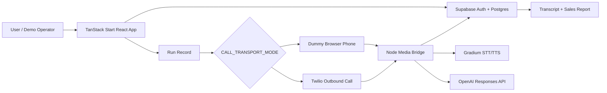

# Architecture

## Product Summary

Berlin AI Hackathon Sales Agent is a web app for configuring an outbound sales-call workflow, launching a live voice conversation, and reviewing the resulting transcript and sales report.

The project supports two call transports:

- `dummy`: a browser-based phone handset for low-cost demos.
- `twilio`: a real outbound phone call using Twilio Media Streams.

Both transports route audio through the same local Node media bridge, which handles speech-to-text, agent reply generation, text-to-speech, transcript updates, and call state updates.

## High-Level Flow



## Main Components

| Area | Files | Purpose |
| --- | --- | --- |
| App shell and routing | `src/routes`, `src/router.tsx` | TanStack Start routes for landing, auth, dashboard, flows, runs, and API handlers. |
| Flow builder | `src/routes/flows.$flowId.tsx` | Lets a user define company context, offer, and agent persona, then start a call. |
| Run detail | `src/routes/runs.$runId.tsx` | Shows call status, transcript, errors, and generated sales report. |
| Dummy handset | `src/routes/phone-dummy.$number.tsx` | Browser phone UI that registers with the media bridge and accepts WebRTC calls. |
| Media bridge | `services/dummy-phone-media/server.ts` | Local Node service for dummy phone signaling, WebRTC audio, Twilio media streams, STT/TTS, and transcript updates. |
| Conversation core | `src/lib/conversation-core.ts` | Shared OpenAI, Gradium, transcript, and audio conversion logic. |
| Twilio integration | `src/lib/twilio.ts`, `src/routes/api/twilio/*` | Creates outbound calls, serves TwiML, validates Twilio signatures, and maps statuses. |
| Supabase | `src/integrations/supabase`, `supabase/migrations` | Auth, typed clients, admin client, schema migrations, flow and run storage. |

## Runtime Services

### Main App

Runs on port `8080` during local development:

```bash
npm run dev
```

Responsibilities:

- Authentication and UI.
- Flow creation and editing.
- Run creation.
- Server functions for starting calls and generating reports.
- Twilio webhook endpoints.

### Media Bridge

Runs on port `8788` by default:

```bash
npm run dummy-phone-media
```

Responsibilities:

- Dummy phone WebSocket registration.
- Dummy phone WebRTC signaling and audio streaming.
- Twilio Media Stream WebSocket handling.
- Voice activity detection.
- Speech-to-text through Gradium.
- Agent replies through OpenAI.
- Text-to-speech through Gradium.
- Transcript persistence in Supabase.

## Data Model

The app primarily uses two user-facing tables:

- `flows`: user-owned sales workflows containing name, company context, offer context, and agent persona.
- `runs`: individual call attempts/conversations tied to a flow, including status, transcript, report, call transport metadata, and provider status fields.

Schema changes live in `supabase/migrations/`.

## External Services

| Service | Used For |
| --- | --- |
| Supabase | Authentication, database, realtime run updates, service-role server access. |
| OpenAI | Conversational agent replies and structured sales report generation. |
| Gradium | Speech-to-text and text-to-speech for live voice conversations. |
| Twilio | Optional real outbound phone calls and media stream transport. |
| ngrok | Optional public tunnels for phone/Twilio demos from a local machine. |

## Key Design Choices

- The dummy phone mode allows reliable hackathon demos without carrier or Twilio account friction.
- The same media bridge handles both dummy and Twilio transports, keeping conversation behavior consistent.
- Supabase stores state centrally so the UI can update call status and transcript in near real time.
- OpenAI is used for short spoken replies and structured post-call analysis.
- Gradium is used for both STT and TTS so the agent can speak and listen in a live conversation.

## Known Operational Constraints

- `.env` must be filled before the app can run successfully.
- For real-device dummy phone demos, both app and media bridge need public HTTPS URLs.
- Twilio mode requires a public app URL, a public media bridge URL, a valid Twilio account, and a verified/owned `TWILIO_FROM_NUMBER`.
- `vite.config.ts` currently includes a hardcoded ngrok `allowedHosts` entry that may need to be changed for a new tunnel.
